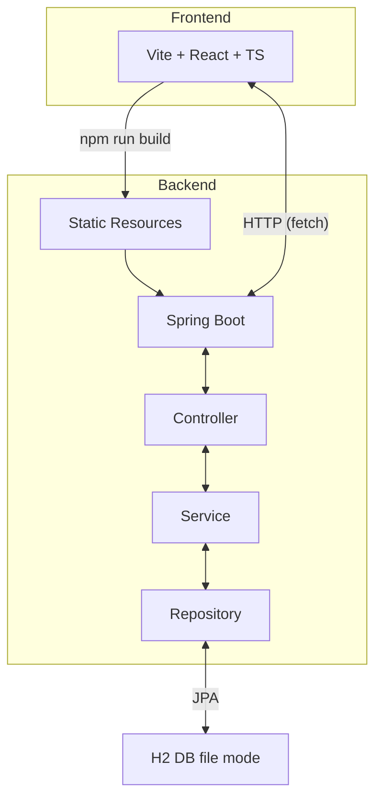

# spring-react
Boilerplate code for starting a project with Spring boot, ReactJS, H2 file based.

- **React** 19.1.0
- **Typescript** 5.8.3
- **Spring boot** 3.5.0
- **Java** 24
- **H2** that comes with spring

# Architecture

### Screenshot

